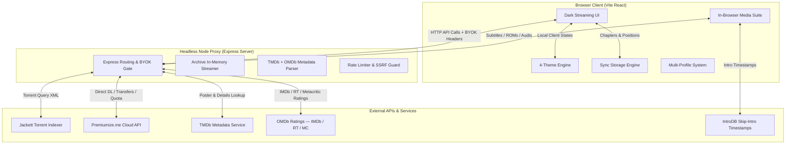

# PREMIO — Premiumize & Usenet Media Suite

**Premio** is a personal, stateless web application that serves as a unified interface and media manager for your **Premiumize.me** cloud storage. It integrates multi-tracker torrent aggregation, Usenet Newznab search, TMDb metadata, OMDb ratings, and an AI assistant into a professional dark streaming interface — letting you search, verify cache status, and **stream movies, TV, audiobooks, eBooks, and retro games directly in your browser**.

Built with a strict **Bring-Your-Own-Key (BYOK) stateless architecture**, Premio keeps your API keys secure and never stores them on any server.

---

## System Architecture



---

## Key Features

### 1. Multi-Tracker & Usenet Search Aggregator

* **Unified "All" Search**: A single query searches across every category simultaneously — Movies, TV Shows, Music, Audiobooks, eBooks, Software, VST, Retro Games, and Adult — with results grouped by type. No need to pick a category first.
* **Category Lanes**: Drill into a specific category for focused results.
* **Concurrent Indexer Aggregation**: Searches across all indexer feeds configured in your local Jackett instance in parallel, with a 90-second timeout and graceful fallback so a slow indexer never hangs the whole search.
* **AI Semantic Search**: Run concurrent multi-title searches using natural language — e.g. *"find me Interstellar and Dune"* — powered by the Premiumize.ai assistant.
* **CDN Cache Verification**: Queries the Premiumize.me API to check which torrents are instantly streamable, highlighting cached releases with an `Instant` badge.
* **Drag-and-Drop Importer**: Drop a `.torrent`, `.nzb`, or magnet link directly onto the page. Premio parses it, checks cache status, and presents it as a result card.

### 2. In-Browser Media Players

* **Video Streamer**: Stream video files directly in-browser with native controls, or generate direct-play links for external players like VLC.
  * **IntroDB Skip Intro**: Automatically fetches intro segment timestamps from [IntroDB](https://introdb.app) when you start a TV episode. A "Skip Intro" button appears timed to the intro, and an **Auto-Skip** toggle in Settings fast-forwards past intros automatically.
  * **TMDb + OMDb Integration**: Fetches posters, ratings, genre tags, cast details, plot summaries, trailers, and multi-source ratings (IMDb, Rotten Tomatoes, Metacritic) for every movie and TV title.
* **Audio Player**: Designed for music albums and audiobooks.
  * Compiles folders of audio tracks into playable playlists.
  * Features a rotating vinyl record visualizer.
  * Supports timeline scrubbing and playback speed adjustments (0.75× to 2.0×).
* **eBook & PDF Reader**: Read books, comics, and technical PDFs.
  * Side-by-side Table of Contents drawer.
  * Adjustable font size.
  * Screen filters: Night mode, Sepia tone, and Day mode.
* **Retro Arcade Console**: Powered by EmulatorJS.
  * Supports `.nes`, `.sfc/.smc`, `.md`, `.gb/.gbc/.gba`, `.a26`, `.a78` ROM formats.
  * Zip ROM Decompressor: Unzips and boots games stored in `.zip` archives on Premiumize.
  * Scrolling lock prevents arrow keys from scrolling the page during gameplay.

### 3. Multi-Source Ratings (OMDb)

* **IMDb, Rotten Tomatoes & Metacritic** ratings pulled via the OMDb API and displayed as color-coded pills in the detail drawer alongside TMDb scores:
  * **IMDb** — gold pill
  * **Rotten Tomatoes** — red pill
  * **Metacritic** — green pill
* Ratings are fetched using the IMDb ID provided by TMDb for exact matching. Cached metadata entries are automatically backfilled with ratings on next view.
* Requires an OMDb API key (free at [omdbapi.com](https://www.omdbapi.com/apikey.aspx)) entered in Settings or set as `OMDB_API_KEY` in `.env`.

### 4. Cloud Storage Manager

* **Cloud File Browser**: Navigate your Premiumize folder tree with a professional card-based layout — folder cards and file cards with thumbnails, metadata, and action buttons.
* **File Actions**: Rename, delete, generate direct download links, or save files to your library — all from the card.
* **Quota Dashboard**: Displays account space usage in real-time. The quota bar changes color dynamically (teal → amber → red) based on usage.
* **Transfer Manager**: Track active torrent downloads on Premiumize with status bars and cancellation controls.

### 5. Continue Watching & Progress Tracking

* **Progress Checkpoints**: Saves video playback timestamp, audiobook chapter, and book scroll position per profile.
* **Backdrop Cards**: The Continue Watching section shows 16:9 backdrop art (or poster fallback) with a title, time-remaining overlay, and a progress bar pinned to the bottom edge.
* **Resumable Sub-Shelves**: Resume watching, listening, or reading from where you left off.

### 6. Watchlist & Notifications

* **Per-Profile Watchlist**: Add any title to your watchlist. Premio periodically checks cache status for watchlisted items and raises an in-app notification when a cached release becomes available.
* **Notification Center**: Badge count and notification feed for newly-available watchlisted titles.
* **Discovery**: "New this week" row surfaces TMDb trending titles that are instantly streamable right now via Premiumize cache.

### 7. Multi-Profile System

* **Up to 5 Profiles**: Each profile has a custom name, avatar, and fully isolated library, watchlist, continue-watching history, and settings — all stored in `localStorage` with per-profile namespace keys.
* **PIN Locks**: Optional 4-digit PIN lock per profile to prevent switching without authorization. PINs are hashed locally.
* **Age Rating Filters**: Lock a profile to a maximum content rating (G, PG, PG-13, R). Filtered profiles hide results above the selected rating from search and library views. Labeled as a soft/convenience lock (not a security boundary).

### 8. Usenet Suite

* **Multi-Indexer Aggregation**: Connect multiple Newznab-compliant indexers via Settings. Premio queries endpoints asynchronously, deduplicates, and lists available sources on each result card.
* **Usenet Health & Completion Predictor**: Renders a completion probability indicator (Excellent / Moderate / Suspect) based on post age, grabs, and password-protection status.
* **Auto-Decryption Archive Streamer**: Extracts passwords from indexer listings and feeds them into the in-memory unzip/unrar streaming engine for automatic decryption of password-protected archives.
* **Usenet Cloud Submission**: Forwards NZB links directly to Premiumize's transfer creator.
* **Rich Metadata Resolution**: Parses IMDb and TVDB tags from Usenet XML attributes to retrieve posters, plots, and ratings from TMDb.
* **Fair-Use Points Warning**: Explains the double-cost structure for Usenet downloads on Premiumize (1 pt/GB download + streaming fair-use). Dismissible.

### 9. Theme Customization

Four built-in dark themes, persisted in `localStorage`:

* **Midnight Nebula**: Indigo base with purple and pink accents.
* **Nordic Frost**: Dark navy with blue and teal highlights.
* **Retro Synthwave**: Warm orange-gold and pink gradients.
* **Obsidian Slate**: Minimalist stealth black with slate-gray highlights.

### 10. Developer Privacy Lock

* Click the **PREMIO** header wordmark **5 times in 2 seconds** to toggle visibility of Adult search categories.
* When locked, adult queries, results, transfers, and bookmarks are filtered from all views.

### 11. AI Co-Pilot (Premiumize.ai)

Premio integrates with your **Premiumize.ai** account for an intelligent media companion:

* **AI Filename Cleaner**: Clean up messy release folder/file names in one click while renaming in the cloud browser.
* **AI Playlist Curator**: Use natural language rules when building playlists (e.g. *"only seasons 1 and 2, chronological"*) to filter and sort files.
* **Floating AI Chat Sidebar**: A slide-out chat panel (chatbot icon with animated pulse ring in the bottom-right corner) powered by your preferred Premiumize.ai LLM (GPT-4o, Llama, DeepSeek). Swaps to a close icon when the panel is open.

---

## Security Model

Premio uses a strict **Bring-Your-Own-Key (BYOK)** architecture:

* Every API-touching endpoint requires the caller to supply their own keys via request headers (`X-Premiumize-Key`, `X-Jackett-Key`, `X-TMDb-Key`, `X-OMDb-Key`, etc.).
* The server **never falls back to the owner's `.env` keys in production**. `ALLOW_ENV_KEYS` must remain unset or `false` on any public deployment.
* Set `ALLOW_ENV_KEYS=true` only in local `.env` for personal development, so you can test without entering keys in the UI on every restart.
* **Rate limiting** on all `/api` routes, with stricter limits on keyless endpoints.
* **SSRF guard**: The subtitle and ROM proxy endpoints validate URLs against a safe-fetch allowlist before making any outbound request.
* **Helmet** security headers (HSTS, CSP, X-Content-Type-Options, frameguard) on all responses.
* **CORS**: Restricted to configured origins (`CORS_ALLOWED_ORIGINS`); wildcard `*` is not used in production.
* **Archive safety**: Zip/rar extraction validates each entry path against the target directory to prevent zip-slip attacks.

---

## Tech Stack

* **Backend**: Node.js + Express (ESM, Node 24), native `fetch`, in-memory zip/rar streaming
* **Frontend**: React 18 (Vite), custom CSS with HSL theme variables and glassmorphism — no heavy UI framework
* **Icons**: Custom inline-SVG `Icon` component (~49 Tabler-style icons) — no CDN dependency, works offline
* **Typography**: [Audiowide](https://fonts.google.com/specimen/Audiowide) for the PREMIO wordmark; system sans-serif for UI

---

## Quick Start

### Prerequisites

1. **Node.js** v18+ (v24 recommended)
2. **Jackett** (optional — only required for torrent search aggregation)

### Install

```bash
git clone https://github.com/BioHapHazard/premio.git
cd premio
npm run install-all
```

### Configure (optional — local dev only)

Copy `.env.example` to `.env` and fill in your keys. Set `ALLOW_ENV_KEYS=true` so the server uses them without requiring UI entry during dev.

```bash
cp .env.example .env
```

Key variables:

```env
PORT=3001
JACKETT_URL=http://localhost:9117
JACKETT_API_KEY=your_jackett_api_key
PREMIUMIZE_API_KEY=your_premiumize_api_key
TMDB_READ_TOKEN=your_tmdb_v4_read_access_token
OMDB_API_KEY=your_omdb_api_key          # optional — IMDb/RT/MC ratings
ALLOW_ENV_KEYS=true                     # local dev only — NEVER set in production
```

> **In production, leave `ALLOW_ENV_KEYS` unset.** Each visitor supplies their own keys via the in-app Settings panel.

### Launch

```bash
npm run dev-all
```

* **Frontend UI**: `http://localhost:5173` (Vite HMR)
* **Backend API**: `http://localhost:3001`

### Docker (Production)

```bash
docker build -t premio-media-suite .
docker run -p 3001:3001 premio-media-suite
```

---

## Setting Up Jackett

1. **Install Jackett**: Download from [Jackett Releases](https://github.com/Jackett/Jackett/releases), or use the included macOS ARM64 binary under `/Jackett/`.
2. **Launch**: `./Jackett/jackett &` — Jackett runs at `http://localhost:9117`.
3. **Add Indexers**: Open the Jackett dashboard → **+ Add Indexer** → configure your public/private trackers.
4. **Connect to Premio**: Copy the API key from the Jackett dashboard top-right and enter it in Premio Settings.

---

## Setting Up Premiumize.ai (AI Co-Pilot)

1. Sign in at [premiumize.ai](https://premiumize.ai).
2. Open DevTools → Network tab → filter by Fetch/XHR → send a chat message → find the `completions` request → copy the `authorization` header value (`Bearer eyJ...`).
3. In Premio Settings → enable **AI Assistant** → paste the token → click **Fetch Models** → select your model.

---

## Project Structure

```
Premio/
├── server.js               # Express backend — BYOK gate, API proxy, streaming, security
├── package.json
├── .env                    # Local secrets (git-ignored, never committed)
├── .env.example            # Template with documentation for all variables
├── Jackett/                # macOS ARM64 Jackett binary
├── frontend/
│   ├── src/
│   │   ├── App.jsx         # React app — all UI, routing, state, players
│   │   ├── App.css         # Custom CSS — dark themes, glassmorphism, design tokens
│   │   ├── Icon.jsx        # Inline-SVG icon component (~49 icons, no CDN)
│   │   └── main.jsx        # Entry point
│   ├── public/
│   │   ├── audio.html      # Vinyl visualizer audio player
│   │   ├── reader.html     # PDF & eBook reader
│   │   └── emulator.html   # EmulatorJS retro console
│   └── package.json
└── README.md
```

---

## Cloud Sync & Backups

Bookmarks and library state are stateless on the client but automatically backed up to your Premiumize.me cloud storage inside a folder named `PremiumSearch_Sync`. This name is preserved for backward compatibility with existing bookmarks and checkpoints.

---

## Credits

**Author & Lead Developer**: Built by **[BioHapHazard](https://github.com/BioHapHazard)**

---

## License

MIT License — see [LICENSE](LICENSE) for the full text.
