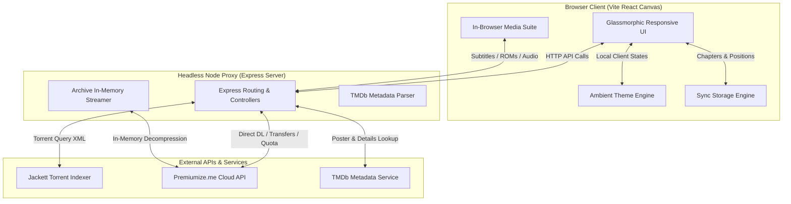

# ⚡ Premio — Real-Time Premiumize & Usenet (Newznab) Aggregator • Personal Cloud Media Suite

**Premio** is a 100% stateless web application that serves as a unified interface and media manager for your **Premiumize.me** cloud storage and Usenet downloader. 

By integrating multi-tracker torrent aggregation and **Usenet Newznab search** with active cloud locker management, Premio lets you search across public and private trackers or Usenet newsgroups, verify CDN caching status, add transfers, and **stream movies, listen to audiobooks, read books, or boot retro arcade games directly in your browser**.

Built with a glassmorphic UI, preset dark themes, and a strict **Bring-Your-Own-Key (BYOK) stateless architecture**, Premio keeps your API keys secure by running entirely in your browser with zero remote database storage.

---

## 📐 System Architecture

Premio is designed to be lightweight, fast, and stateless. It proxies commands directly to Jackett and the Premiumize APIs, keeping all user data secure and local to the web client:



---

## 🌟 Key Features

### 🔍 1. Multi-Tracker Search Aggregator
* **Concurrent Indexer Aggregation**: Searches across indexer feeds configured in your local Jackett instance.
* **Category Lanes**: Browse search results in categories:
  * `🎥 Movies` | `📺 TV Shows` | `🎧 Music` | `📻 Audiobooks` | `📖 Ebooks` | `💻 Software` | `🎹 VST` | `🔞 Adult` | `🎮 Retro Games` | `📁 Other`
* **CDN Cache Verification**: Queries the Premiumize.me API to check which torrents are already cached, highlighting cached releases with an `🟢 Instant DL` badge for direct cloud transfers.

### 🎮 2. In-Browser Media Players
Premio includes built-in media players to stream files directly from your browser:
* **🎬 Movie & Episode Streamer**: Stream video files directly in-browser with native controls, or generate direct-play links to launch external players like VLC.
  * **TMDb Integration**: Optionally fetches movie posters, ratings, genre tags, cast details, plot summaries, and trailers.
* **🎧 Audio Player**: Designed for music albums and audiobooks.
  * Compiles folders of audio tracks into playable playlists.
  * Features a rotating vinyl record visualizer.
  * Supports timeline scrubbing and playback speed adjustments ($0.75x$ to $2.0x$).
* **📖 eBook & PDF Document Reader**: Read books, comics, and technical PDFs.
  * Includes a side-by-side Table of Contents drawer.
  * Adjust font size.
  * Screen filters (Night mode, Sepia tone, and Day mode).
* **🎮 Retro Arcade Console (Emulator)**: Powered by EmulatorJS to play ROMs directly inside the browser.
  * Supports `.nes`, `.sfc` / `.smc`, `.md`, `.gb` / `.gbc` / `.gba`, `.a26`, and `.a78` ROM formats.
  * **Zip ROM Decompressor**: Unzips and boots games stored in compressed `.zip` folders on Premiumize.
  * **Scrolling Lock**: Prevents arrow keys from scrolling the webpage during gameplay.

### 📊 3. Cloud Storage & Quota Manager
* **Cloud File Browser**: Navigate your Premiumize folder directories, rename files/folders, delete content, generate direct download links, or save files to your library.
* **Quota Dashboard**: Displays account space usage in real-time (`246.96 GB / 1000 GB Used`). The quota bar changes color dynamically based on use (teal for safe, amber for warnings, and red for critical capacity).
* **Transfer Manager**: Track active torrent downloads on Premiumize with status bars and cancellation controls.

### ⏱️ 4. Continue Watching & Progress Checkpoints
* **Progress Tracking**: Saves video playback timestamp, audiobook chapter progress, and book scroll offset position.
* **Resumable Sub-Shelves**: Resume reading, playing, or watching files from the continue watching section.

### ⚡ 5. Usenet & Local Imports Suite
* **📂 Drag-and-Drop NZB/Torrent/Magnet Importer**: Drag and drop a `.torrent` or `.nzb` file, or paste a magnet link. Premio's backend parses the metadata and checks the Premiumize CDN cache status, presenting it as a search result.
* **🔀 Multi-Indexer Aggregation**: Connect multiple Newznab-compliant indexers via the settings Control Panel. Premio queries endpoints asynchronously, removes duplicates, and lists available sources on the result card (e.g. `Source: NZBGeek, AltHub`).
* **🩺 Usenet Health & Completion Predictor**: Renders a completion probability indicator on Usenet cards (Excellent, Moderate, or Suspect), based on a mathematical decay equation factoring in post age, grabs, and password protection status.
* **🔄 Auto-Decryption Archive Streamer**: If an audiobook, ROM, or music album inside a `.zip` or `.rar` archive is password-protected, Premio extracts the password from indexer listings and feeds it into the in-memory unzip/unrar streaming engines for automatic decryption.
* **Double-Cost Fair-Use Points Warning**: Displays a warning explaining that Premiumize charges `1 point/GB` to download a Usenet NZB, plus standard fair-use points to stream or download it from your cloud. A toggle allows you to dismiss this warning.
* **Rich Metadata Resolution Cache**: Parses IMDb and TVDB tags from Usenet XML attributes, feeding them to TMDb endpoints to retrieve posters, plots, and ratings.
* **Usenet Cloud Submission**: Forwards the direct NZB link (`enclosure.url`) directly to Premiumize's transfer creator.

### 🎨 6. Theme Customization
Switch the application's theme preset. Your preference is persisted in `localStorage`:
* 🌌 **Midnight Nebula**: Indigo base with purple and pink accents.
* 🧊 **Nordic Frost**: Dark navy base with blue and teal highlights.
* 🍊 **Retro Synthwave**: Warm orange-gold and pink gradients.
* 🪵 **Obsidian Slate**: Minimalist stealth black base with slate gray highlights.

### 🔒 7. Developer Privacy Lock
* **Logo Unlocks**: Click the header logo **5 times in 2 seconds** to toggle visibility of Adult search categories.
* **Privacy Filter**: When locked:
  * Adult search queries and results are filtered out.
  * Search keywords in the Adult category are excluded from local history.
  * Active adult transfers are omitted from local download logs.
  * Bookmarked adult releases are hidden from view.

---

## 💻 Tech Stack & Dependencies

* **Backend**: Node.js + Express (Modular ES Modules, natively using fetch APIs, group cache algorithms, and in-memory zip streaming).
* **Frontend**: React (Vite) + Premium Vanilla CSS (custom dynamic HSL theme variables, frosted glassmorphism, responsive grid/flex systems).
* **No Bloat**: Designed without heavy third-party styling frameworks to maximize speed, responsiveness, and control.

---

## 🚀 Quick Start Guide

### Prerequisites
1. **Node.js** (v18.0.0 or higher recommended)
2. **Jackett** installed on your local host (optional, only required to enable the search aggregator)

---

### Step 1: Install Dependencies
Clone the repository and run the integrated installer script from the root directory:
```bash
npm run install-all
```
*Alternatively, you can manually run `npm install` in both the root folder and the `frontend/` folder.*

---

### Step 2: Configure API Credentials (BYOK)

Premio features a **Bring-Your-Own-Key (BYOK) architecture**. You do **not** need to configure any environment files to run the app. You can deploy it instantly and configure your credentials directly inside the web UI:

1. Launch Premio and click the **⚙️ Control Panel** button in the top right corner.
2. Input your **Premiumize API Key**, **TMDb API Key**, **Jackett Server URL/Key**, and **Usenet indexers** list.
3. Your keys are saved locally in your browser's secure `localStorage` and sent with each request in secure headers. They are never logged or stored on any server database.

---

### Step 3 (Optional): Fallback Environment Variables

If you are self-hosting Premio and want to define default API keys for your instance, copy `.env.example` to `.env`:
```bash
cp .env.example .env
```
Open `.env` in a text editor and fill in your details:
```env
PORT=3001
JACKETT_URL=http://localhost:9117
JACKETT_API_KEY=your_jackett_api_key_here
PREMIUMIZE_API_KEY=your_premiumize_api_key_here
TMDB_API_KEY=your_tmdb_api_key_here
```

> [!TIP]
> **Developer Mock Mode**: If you leave these environment variables blank and do not supply UI keys, Premio operates in a fully functional **Developer Mock Mode**. This offline sandbox serves highly realistic mock results and progress graphs, allowing complete inspection of Premio's premium aesthetic immediately without any keys!

---

### Step 4: Launch the Application

You can launch Premio either using Node.js locally or via Docker:

#### Method A: Local Node.js Development
Start both the Express backend and the Vite development server concurrently with a single command from the root directory:
```bash
npm run dev-all
```
Premio is now available at:
* **Frontend UI**: `http://localhost:5173` (with Hot Module Replacement)
* **Backend API Gateway**: `http://localhost:3001`

#### Method B: Docker Container (Production)
Build and run the unified Docker container:
```bash
# 1. Build the production image
docker build -t premio-media-suite .

# 2. Start the container in stateless mode
docker run -p 3001:3001 premio-media-suite
```
Premio is now available in production mode at `http://localhost:3001`.

---

## ⚙️ Setting Up Jackett (Optional)

Jackett serves as an XML/JSON indexer proxy, aggregating search requests and translating them to indexer feeds.

1. **Install Jackett**:
   * macOS (via Homebrew): `brew install --cask jackett`
   * Windows / Linux: Download from the official [Jackett Releases Page](https://github.com/Jackett/Jackett/releases).
2. **Launch & Configure Indexers**:
   * Open `http://localhost:9117` in your browser.
   * Click **"+ Add Indexer"** and select your preferred public or private trackers.
3. **Connect to Premio**:
   * Copy the **API Key** located in the top-right corner of the Jackett web panel.
   * Paste it as `JACKETT_API_KEY` in your `.env` file and restart Premio.

*Tip: A pre-compiled macOS ARM64 binary of Jackett is also included in the repository under the `/Jackett` folder. It can be initialized by running `./jackett` in your terminal inside that directory.*

---

## 📂 Project Directory Structure

```
Premio/
├── server.js               # Stateless Express backend (handles file streaming, api proxying, sync)
├── package.json            # Main app dependencies and task runner scripts
├── .env                    # Local environment secrets and keys (git-ignored)
├── Jackett/                # Standalone Jackett indexer binary files
├── frontend/
│   ├── src/
│   │   ├── App.jsx         # Central React container, page routing, and state manager
│   │   ├── App.css         # Custom layout, styling variables, CRT scanlines, and glass themes
│   │   └── main.jsx        # App entry point
│   ├── public/             # Static public player HTML interfaces
│   │   ├── audio.html      # Vinyl disc visualizer and playlist audio player
│   │   ├── reader.html     # PDF & eBook Table of Contents reader
│   │   └── emulator.html   # EmulatorJS retro cabinet console wrapper
│   └── package.json        # Frontend configuration and Vite bundle settings
└── README.md               # User and developer manual
```

---

## 💾 Cloud Synchronization & Backups

Premio keeps your library shelves and continues dashboards completely stateless on the local client, but automatically backs up your bookmarks to the cloud. 
* All synchronization files are safely backed up to your Premiumize.me cloud storage inside a folder named `PremiumSearch_Sync`.
* This folder name is preserved to ensure full backward compatibility, keeping all existing bookmarks and reading checkpoints intact!

---

## 👥 Credits

* **Author & Lead Developer**: Built with ⚡ by **[BioHapHazard](https://github.com/BioHapHazard)**. 🚀

---

## ⚖️ License

This project is licensed under the **Creative Commons Attribution-NonCommercial 4.0 International (CC BY-NC 4.0)** license. 

* **Attribution**: You must give appropriate credit to **BioHapHazard** and provide a link to the original repository.
* **Non-Commercial**: You may not use this software or its derivative works for commercial purposes or financial gain.
* **Free Sharing**: Anyone is free to share, copy, and redistribute the material in any medium or format.

See the [LICENSE](file:///Users/shilgenfeld/Desktop/Premiumize%20Cache%20Search/LICENSE) file for the full legal text.
